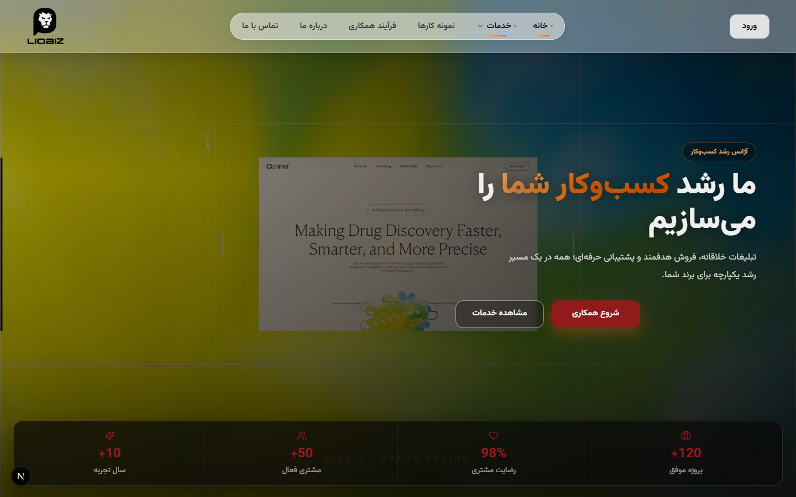
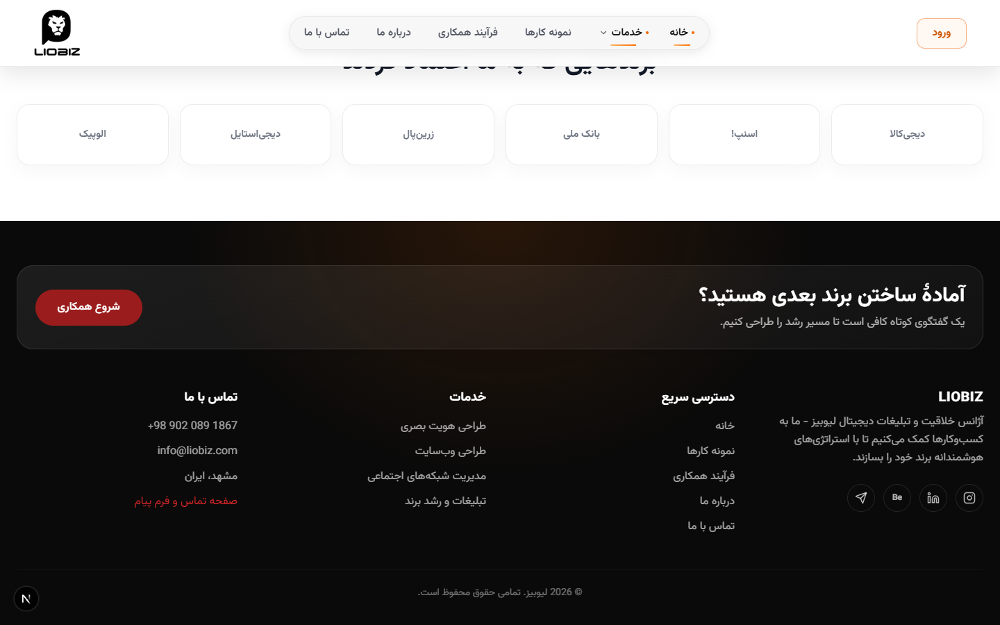
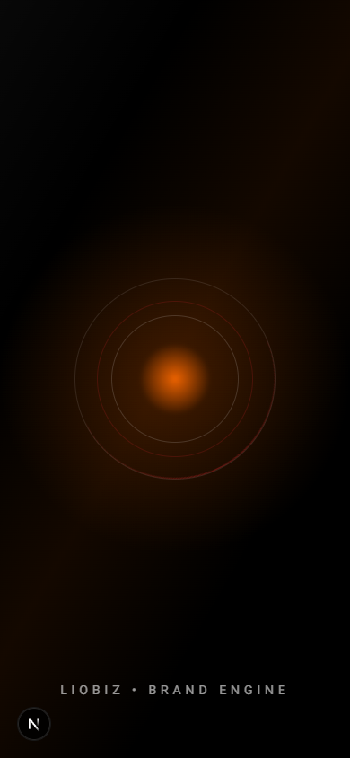
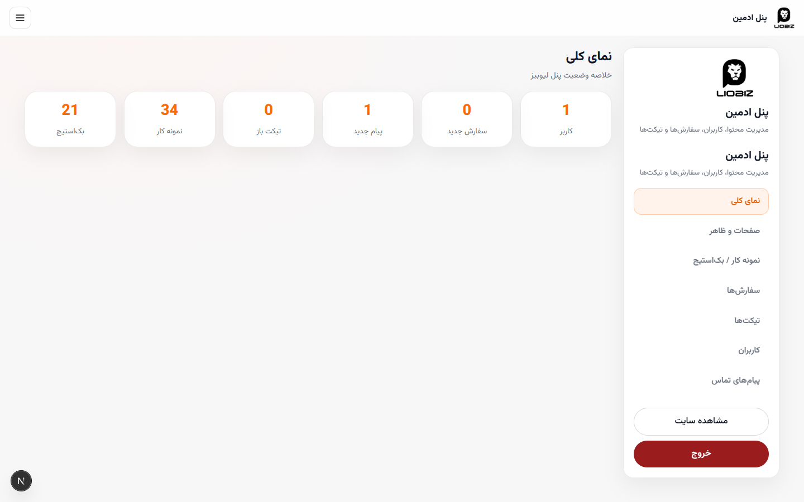
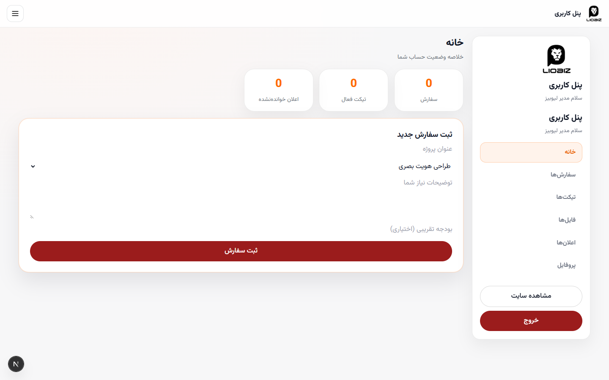

# Liobiz Light Dashboard

وب‌سایت رسمی و پنل مدیریت **لیوبیز** — آژانس خلاقیت و تبلیغات دیجیتال (RTL / فارسی).

این ریپو شامل لندینگ کامل، صفحات خدمات، احراز هویت، **پنل ادمین** و **داشبورد کاربر** است.

---

## این پروژه چیست؟

| بخش | توضیح |
|------|--------|
| لندینگ | هیرو ویدیویی، خدمات، نمونه کار، بک‌استیج، پلن‌ها، درباره لیوبیز |
| صفحات داخلی | درباره ما، فرآیند، پورتفolio، تماس، جزئیات هر خدمت |
| پنل ادمین | CMS صفحات/ظاهر، نمونه کار، سفارش‌ها، تیکت‌ها، کاربران، پیام‌ها |
| داشبورد کاربر | سفارش، تیکت، فایل تحویل، اعلان، پروفایل |
| دیتابیس | SQLite + Drizzle (`data/liobiz.db`) |

---

## Preview



### فوتر (تمام‌عرض)



### موبایل



### پنل ادمین



### داشبورد کاربر



---

## Screenshots

| صفحه | فایل |
|------|------|
| صفحه اصلی | [01-home.png](docs/screenshots/01-home.png) |
| درباره ما | [02-about.png](docs/screenshots/02-about.png) |
| نمونه کارها | [03-portfolio.png](docs/screenshots/03-portfolio.png) |
| فرآیند همکاری | [04-process.png](docs/screenshots/04-process.png) |
| تماس | [05-contact.png](docs/screenshots/05-contact.png) |
| ورود | [06-login.png](docs/screenshots/06-login.png) |
| ثبت‌نام | [07-register.png](docs/screenshots/07-register.png) |
| خدمات برندینگ | [08-service-branding.png](docs/screenshots/08-service-branding.png) |
| خدمات وب | [09-service-web.png](docs/screenshots/09-service-web.png) |
| شبکه‌های اجتماعی | [10-service-social.png](docs/screenshots/10-service-social.png) |
| تبلیغات | [11-service-ads.png](docs/screenshots/11-service-ads.png) |
| پنل ادمین | [12-admin.png](docs/screenshots/12-admin.png) |
| داشبورد کاربر | [13-dashboard.png](docs/screenshots/13-dashboard.png) |
| فوتر | [14-footer.png](docs/screenshots/14-footer.png) |
| موبایل | [15-home-mobile.png](docs/screenshots/15-home-mobile.png) |

---

## اجرا محلی

```bash
pnpm install
cp .env.example .env.local
pnpm run dev
```

باز کنید: [http://localhost:3000](http://localhost:3000)

### ادمین پیش‌فرض (فقط توسعه)

- ایمیل: `admin@liobiz.com`
- رمز: مقدار `ADMIN_PASSWORD` در `.env` (پیش‌فرض توسعه در کد seed شده است — قبل از production عوض کنید)

### اسکرین‌شات دوباره

با سرور در حال اجرا:

```bash
pnpm run screenshots
```

---

## Stack

- Next.js 15 + React 19
- Tailwind CSS + Framer Motion
- Drizzle ORM + better-sqlite3
- Auth با کوکی `httpOnly`

## Deploy

راهنما: [`docs/DEPLOY-VPS.md`](docs/DEPLOY-VPS.md)

پوشه‌های قابل‌نوشتن روی سرور: `data/` و `public/uploads/`

---

## لینک‌های اصلی

| مسیر | نقش |
|------|------|
| `/` | لندینگ |
| `/login` `/register` | ورود / ثبت‌نام |
| `/admin` | پنل ادمین |
| `/dashboard` | پنل کاربر |
| `/contact` | تماس |
| `/portfolio` | نمونه کارها |
